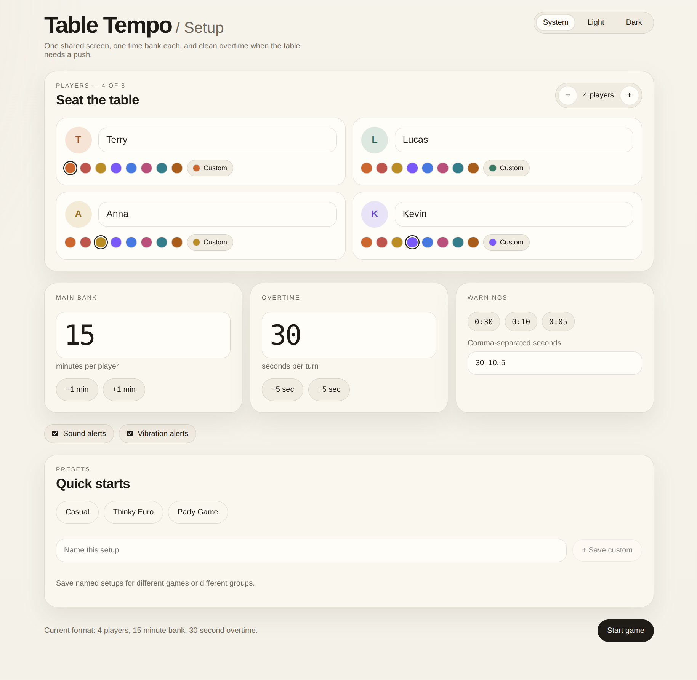
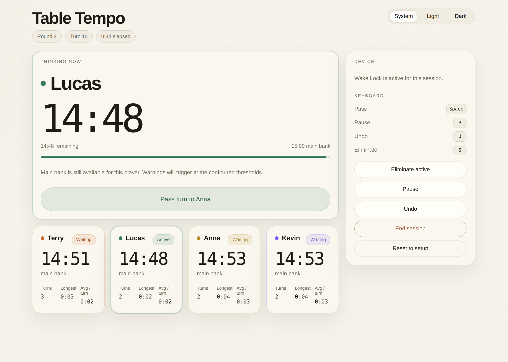
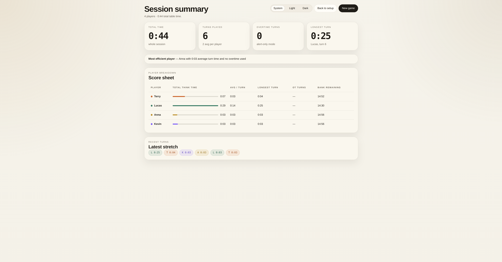

# Table Tempo

## What This Project Is About

Table Tempo is a board game timer built for one shared screen at the table. Each player gets a configurable main time bank, and once that runs out, they switch to a short configurable overtime window on every turn. The goal is to keep games moving without needing accounts, servers, or multiple devices.

## How To Run This Project

### Requirements

- Node.js `18` or newer
- `npm`

### Run In Development

1. Open a terminal in the project folder.
2. Install dependencies:

```bash
npm install
```

3. Start the development server:

```bash
npm run dev
```

4. Open the URL printed in the terminal.
   The default Vite URL is usually:

```text
http://localhost:5173
```

## Timer Functionality

### Setup And Configuration



- Configure between `2` and `8` players.
- Edit each player name.
- Pick a color for each player.
- Set the main time bank.
- Set the overtime time per turn.
- Configure warning thresholds in seconds.
- Enable or disable sound alerts.
- Enable or disable vibration alerts on supported devices.

### Presets

- Use built-in presets for common play styles.
- Save custom presets locally in the browser.
- Load saved presets later.
- Remove saved presets when they are no longer needed.

### Core Timer Rules

- Only the active player's timer counts down.
- Each player starts with a main time bank.
- When a player's main time reaches `0`, that player switches to overtime.
- Overtime is a short per-turn timer.
- The overtime timer resets at the start of each later turn for that player.
- If overtime expires, the app raises a strong alert but does not force the turn to end.

### In-Game Controls



- Start a game from the setup screen.
- Pass the turn to the next player.
- Pause the timer.
- Resume the timer.
- Undo the last turn handoff.
- Eliminate the active player from the session.
- End the session and open the summary screen.
- Reset back to setup.

### On-Screen Information

- A large active-player clock card at the top of the game screen.
- A live timer for the current player.
- A player grid showing current state for everyone in the game.
- Main time remaining for each player.
- Overtime state for each player.
- Total think time for each player.
- Longest turn for each player.
- Visual states for active, waiting, eliminated, and timed-out players.

### Alerts And Device Behavior

- Warning alerts when the active player reaches configured warning thresholds.
- Timeout alerts when overtime expires.
- Wake Lock support when the browser allows it, so the screen is less likely to sleep during play.
- PWA support for installability and offline app-shell behavior.

### Keyboard Shortcuts

- `Space` or `Enter`: pass the turn
- `P`: pause or resume
- `U`: undo the last turn
- `S`: eliminate the active player

### Local Persistence

- Current configuration is saved locally in the browser.
- Custom presets are saved locally in the browser.
- An in-progress session is saved locally in the browser.
- Refreshing the page restores local data when available.

### Summary Screen



- Shows overall session duration.
- Shows the number of turns played.
- Shows the configured warning mode and overtime setting.
- Shows each player's total think time.
- Shows each player's longest turn.
- Shows how many overtime turns each player used.
- Shows remaining main time for each player.
- Shows timeout counts.
- Shows recent turn activity.
- Lets you start again or return to setup.
